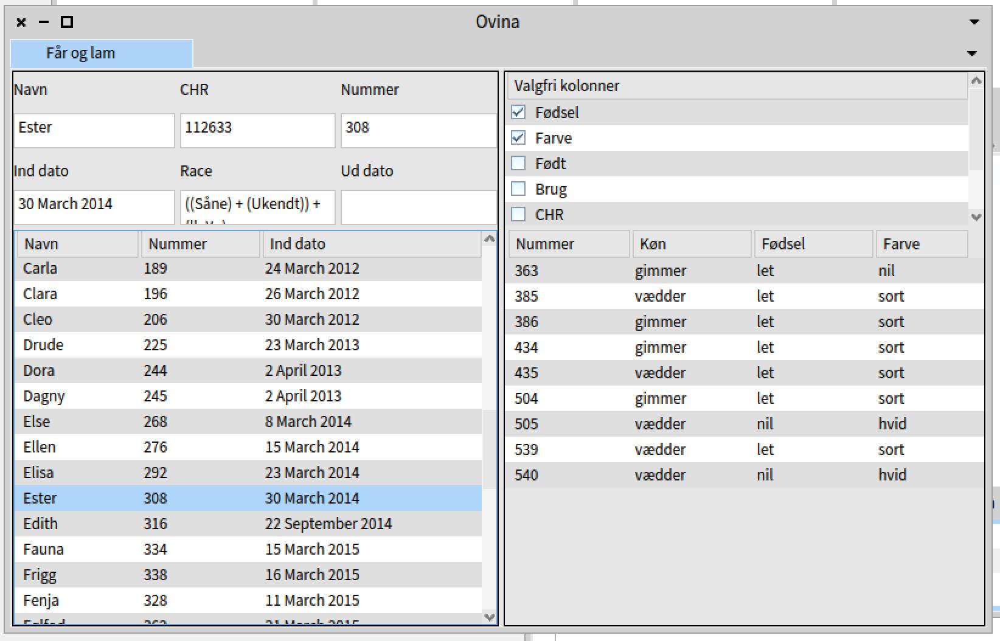
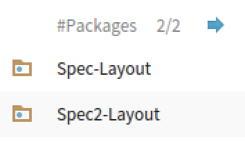
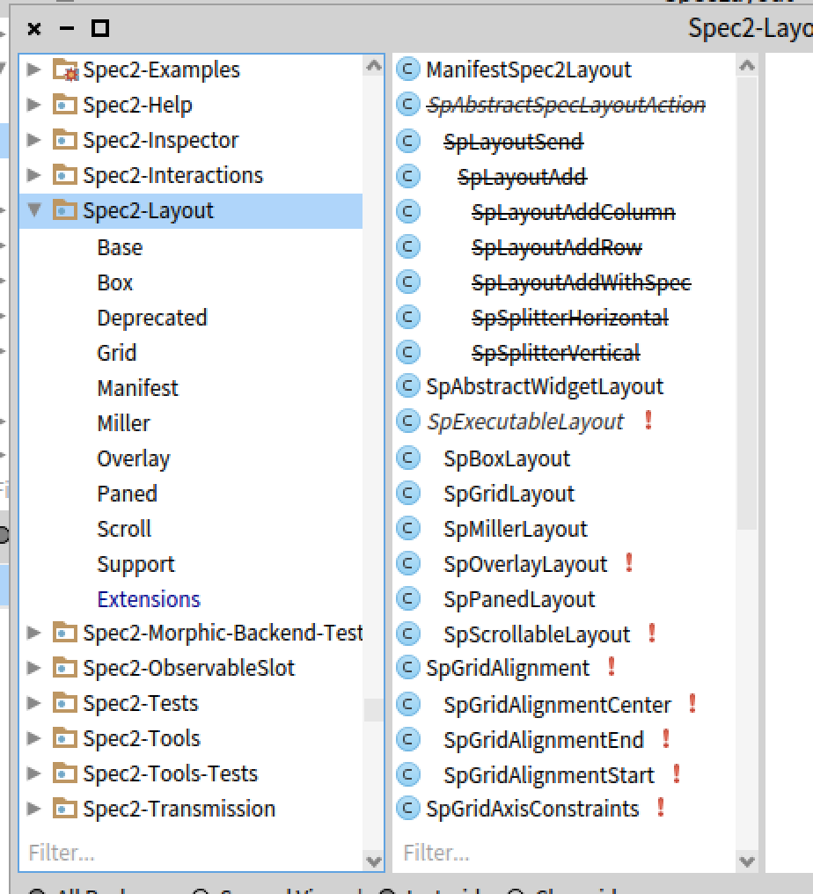
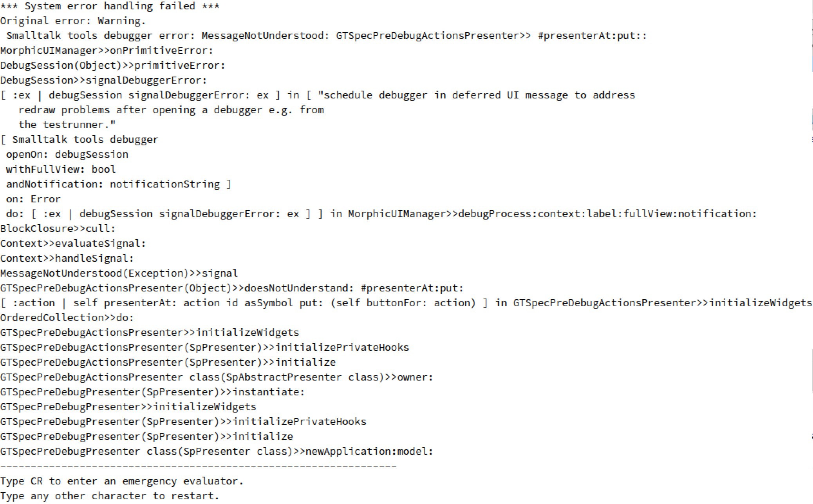

# Spec to Spec2
I had begun a project to develop a sheep admin system for our hobby farm. I had a running Java version in Swing, and wanted to build a similar thing in Pharo.

It is an application where the primary data is tabular, and in my experience tables are a complicated structure, which typically has at least the following objects

* A table render componet which is putting it on the screen
* A datasource componet which act as an intermediary between the actual data and the table render
* Column descriptors: collumn name, allignment, cell render, cell editor
* Selection model: Multiple rows, single row, multi cells, etc
* Presentation specification: default colors, spacings, indentations, zebra tables, intra row/column lines,...
* Event handling for selection, hover, keyboard. For table, headers and cells.
* Sorting and filtering

# Spec mock-up
I did a preliminary mock-up in Spec in the fall of 2019. It looks like this:



The left pane is for ewes (mature female sheeps), and the lambs of the selected ewe is shown to the right.

Above the ewe is shown a small set of attributes for the ewe, which is for the selected ewe. This is because the table is done as a `TreePresenter` which *I was not able to get to edit cells inline*.

Above the lambs is a column selector, which allow me to select which columns to show in the underlying table. In particular for the ewe's there are many possible columns - for example "average growth of lambs per day over the last three years". I toggle the data-entry and column collect views using a click in the header row. Basically because *I did not find a simple way to make my application respond to keyboard shortcuts*.

The data-source is generic, and reads pragmas in the ewe and lamb classes to find potential colums:

```smalltalk
inDate
	<column: 'Ind dato'>
	^ inDate
```

## Migrating to Spec2
The top of the app has a `defaultSpec` method:

```smalltalk
defaultSpec
	^ SpecLayout composed
          add: #mainTabManager;
          yourself
```

Issue: ~~SpectLayout~~ is deprecated in Spec2. I wonder if it is easier to do this migration top-down, or buttom up? Heads or Tails - top-down it is.

### Looking for info in the image itself
1. Perhaps there is a link to the new class or other way to do this in `SpecLayout`. The class comment there however is not updated to cover this: `A SpecPresenter is a object used to describe a user interface`. The class comment of `SpecLayout` talks about a `SpecPresenter`
1. Perhaps there is a new class with a similar name. Spotter is your friend. Spotter brings up two packages which looks promising:<br>
    

    The package comment for `Spec2-Layout' looks promising.
1. OMG, where to go from here? There are a huge number of stuff here.   
    The Base tag does not contain what I am looking for.<br>
    
    
    Most of the classes has no comments, so I will not worry about those.
1. Luck has it that the first on on the list, `Box layout` looks promissing.
    The class comment of `SpBoxLayout` even has an example:<br>
    
    ```smalltalk
SpBoxLayout new
	   add: 'Some header' expand: false fill: false padding: 5;
	   add: #content;
	   addLast: 'Some footer' expand: false fill: false padding: 5;
	   yourself
	```
	
	However, when I change the `defaultSpec` in my class to:
	
	```smalltalk
	defaultSpec
	^ SpBoxLayout new
		add: #mainTabManager;
      yourself
    ```
    and run the code, I get an error from `SpBoxLayout>>new` which is surprising: 
    
    ```smalltalk
    new 
	   self error: 'Use one of my siblings'
    ```
    
    After looking in the code, it is clear that siblings do not refer to an other class, but to one of two alternative new methods (`newHorizontal` or `newVertical`).
1. I picked newHorizontal, and I got pass that problem.

> So, I was able to use SpBoxLayout>>newHorizontal rather than SpecLayout>>composed. 

### ComposablePresenter is deprecated
My app was a subclass of `ComposablePresenter`. That is depricated too.

1. Noone left a departure note in the class comment of `ComposablePresenter`.
2. The package of `ComposablePresenter` is `Spec-Base`, perhaps `Spec2-Base` has something similar?
3. HMM, not quite clear which class to use as superclass now, or if the architecture has moved away from a subclass architecture.
4. Looking for Spec2 example...Woootttt<br>
    Looking in the class categories of the browser, there is indeed an example named `SpDemo`.
    It uses `SpPresenter` as its superclass and has a defaultSpec method which seems to be like mine.
1. UUUPPPS:
    

#### Side tour re. emergency evaluator
[See issue on github](https://github.com/pharo-project/pharo/issues/5570)
 
### Back to the migration.
Deep into the error, it turns out that the `TabManagerPresenter` is now deprecated. The error says that the new thing to use is `SpNotebook`. This is the initializeWidgets before I adapt to the new notebook:

```smalltalk
initializeWidgets
	| tab |
	mainTabManager := self newTabManager.
	tab := self newTab.
	tab presenter: OvinaEweLambTab  new.
	tab
		label: 'Får og lam';
		closeable: false.
	mainTabManager addTab: tab
```

Further in, my `initializePresenter`, I have (this is where I will implement shifting of tabs/pages later):

```smalltalk
initializePresenter
   mainTabManager whenTabSelected: [ 'Hi there' logCr].
```
since the vocabulary changed from `tab` to `page`, I need to rewrite this as : 

```smalltalk
initializePresenter
   mainTabManager whenSelectedPageChangedDo: [ 'Hi there' logCr].
```

Actually, the code works at this step, but there might be more deprecated widgets. But before that, I want to update my code to reflect the terminology of `NoteBook` rather than `Tab`. 

#### Adjusting to new terminology
My class is defined as:

```smalltalk
SpPresenter subclass: #OvinaApp
	instanceVariableNames: 'mainTabManager eweLambTab eventsTab overviewTab'
	classVariableNames: ''
	package: 'Ovina-GUI'
```

That is, all instance variable carry the wrong terminology. Luckily one can rename instance variables.

Then the accessor methods of those variables should be renamed. The easiest way (or the one that just pop up in my head, is to remove the accessors, and then regenerate them).

And then go through the methods and change the self calls.

Also remember to rename the symbol in `defaultSpec` to the new accessor (`#mainNotebook`):

```smalltalk
defaultSpec
	^ SpBoxLayout newHorizontal 
		add: #mainNotebook ;
      yourself
```

## Further migration
At present, I have just gotten the tab and the app adjusted. In addition to those, there are three other widgets which are made as subclasses of the deprecated `ComposablePresenter`. 

#### `LabeledInputField`

This is a simple little class which provide a text input field with a label above it. I guess it exist somewhere in the library already, but I did not find it at the time. Now there seems to be new support for this, but the examples in the `SpDemo` class all put the label to the left of the field, and I wanted it above. I postpone that rewrite for later.

Again, we need to change `defaultSpec` to use `SpBoxLayout`, this time with `newVertical`.

```smalltalk
defaultSpec
	^ SpBoxLayout newVertical 
		add: #labelPresenter height: self toolbarHeight; 
		add: #textPresenter  height: self inputTextHeight ;
		yourself.
```

My `initializeWidgets` contain a call `textPresenter := self instantiate: TextInputFieldPresenter.`. `TextInputFieldPresenter` is deprecated.

Class comment is not updated to reflect deprecated status.

A new class exists `SpTextInputFieldPresenter`, but the right thing to do is to rewrite it as `textPresenter := self newTextInput`.

> I went ahead and changed my widgets to inherit from `SpPresenter`, and introduced `SpBoxLayout newVertical/Horizontal` where needed.

#### Slot lookup issue
My existing code reuse the space on top of the tables for two different widgest, a form with text fields, or a selection list to pick which columns to show in the table below. Which of the two widgets is to use is returned by a `currentView` method, which is set up in the `defaultSpec` of the overall Ewe (or lamb) widget:

```smalltalk
...
    SpBoxLayout newVertical 
		add: #currentView height: height;
		add: #sheepListPresenter;
		yourself
```

However, Spec2 no longer assumes `#currentView` to be a method, but a slot! But as the code is not written using slots but instance variables, it does not find the slot. I get around it by making my code look it up itself:

```smalltalk
presenterAt: aName ifAbsent: aBlock
	"Retrieves a subpresenter of this composed presenter."

	^ [ self perform: aName ]
		on: SlotNotFound
		do: aBlock
```
(And put the method in the category `Ugly code override`)

> At this point I am about to take up an other programming language. This is really bad.

### A small success
I had to rewrite the layout mechanism, and I really like the box layout, which allow me to make horizontals inside a vertical, it looks right in code:

```smalltalk
	^ SpBoxLayout newVertical
		add: ( SpBoxLayout newHorizontal 
					add: #namePresenter;
					add: #chrPresenter;
					add: #numberPresenter;
					yourself );
		add: ( SpBoxLayout newHorizontal 
					add: #inDatePresenter;
					add: #racePresenter;
					add: #outDatePresenter;
					yourself );
		yourself
```

Caveat: The style checkers insist/suggest I use the above code, instead of this which is shorter, and due to popper implementation of `add:` does the same.		

```smalltalk
^ SpBoxLayout newVertical
		add: ( SpBoxLayout newHorizontal 
					add: #namePresenter;
					add: #chrPresenter;
					add: #numberPresenter);
		add: ( SpBoxLayout newHorizontal 
					add: #inDatePresenter;
					add: #racePresenter;
					add: #outDatePresenter)
```

## The class TreePresenter is Deprecated
I find out because I get a runtime error about a `TreePresenter` that does not understand `adapter`. Indeed, here I create a `TreePresenter`:

```smalltalk
createSheepList
	| presenter |
	presenter := TreePresenter new.
	presenter multiSelection: false.
	presenter oddRowColor: Color veryVeryLightGray.
	presenter
		columns:
			(self selectedSheepColumns
				collect: [ :colName | self columnPresenterFor: colName ]).
	presenter roots: self allSheeps.
	^ presenter
```

Still no redirection in the class comment of TreePresenter. There is a SpTreePresenter, but that is depricated too. That is also without any redirection in its class comment.

There is a `Tables` section in the `SpDemos`, so lets take a look. It suggest to look in the class `SpDemoTablePresenter`, which has this method:

```smalltalk
initializePresenters
	table1 := self newTable.
	label := self newLabel.
```
Indeed, the old `ComposeablePresenter` did not have a `newTable` method.

After changing `TreePresenter new` to `self newTable`, I get past that one, but get a message not understood at `presenter multiSelection: false`.

In the debugger I can see that the new class is SpTablePresenter (which is a better name indeed).

Class `SpTablePresenter` do not seem to have any methods for multiple selection control. But it is a subclass of `SpAbstractListPresenter`.

It seems like `SpAbstractListPresenter` uses a kind of `selectionMode` object to handle selection modes. Also, this seems to be in transition as there is a lot of depricated methods in `SpAbstractListPresenter` dealing with selection.

After poking around, there is the method `beSingleSelection`. 

**God dammit - it does not respond to the oddRowColor!!!!**

A search in spotter shows that all implementations of oddRowColor are now depricated. Taking a deep breath, I comment out that piece of code.

Next... `SpTablePresenter` do not get initialized using the method `roots:` (which makes sense, but is an example of what happens when terminology is changed). It is now called `items:`.

### It is no longer TreeColumns...
In the top left of the image in the intro to this note, you can see that I have a table of auxiliary columns that can be included in the main table. It is created using this method:

```smalltalk
createColumnList
	| tree col |
	tree := TreePresenter new.
	tree beCheckList.
	tree multiSelection: true.
	tree autoMultiSelection: true.
	tree oddRowColor: Color veryVeryLightGray.
	col := TreeColumnPresenter new
		displayBlock: [ :pragma | pragma content arguments first ];
		headerLabel: 'Valgfri kolonner';
		yourself.
	tree columns: (Array with: col).
	tree roots: self optionalColumns.
	^ tree
```
Every thing is wrong here. It is no longer tree, but table etc. But it can be fixed like before:

There is no support for beCheckList, so I need to return to the drawing board for this one.

I tried to see if I could use a `SpListPresenter` instead. In there there is an explanation of why the oddRowColor is no longer there:

```smalltalk
backgroundColorBlock: aBlock
	"Set the block used to compute an item background"

	self deprecated: 'Should not use. This feature is not supported anymore. 
	This feature depends on the theme'
```

Sighs! Good things are lost when you join the dark side....

Back to the `beCheckList`. The idea is that you can check of which columns you want to have in the table below. While I should be able to do it using a multiple selection list, having actual check boxes emphasize what I want.

I rewrote the above method into:

```smalltalk
createColumnList
	| checkList |
	checkList := SpTablePresenter new
		addColumn: (SpCheckBoxTableColumn title: 'Medtag' evaluated: #first );
		addColumn: (SpStringTableColumn title: 'Kolonne' evaluated: [:arr | arr second content arguments first]);
		showColumnHeaders.
	checkList items: (self optionalColumns collect: [:col | {false. col}]).
	^ checkList 
```

# Layout is working!

That is, besides the stripes, and I lost some adjustment of the space between labels and text fields, and something is wrong with the comment field for the lambs.

# Events...
No real problems here, the previous text fields converted their input to text strings, whereas `SpTextInputFieldPresenter` do not (so I need to convert integers from the model to String)

# Final comments
I do not feel the migration is fully complete. What I am missing is:

* striped tables
* the checklist do not work yet
* The layout of the input fields are not quite nice yet

## Migrating from Spec to Spec2
Today is Friday January 24th, 2020. Spec2 is a framework in development. My experiece in migrating a Spec to Spec2 has not been without its problems. In particular I want to highlight the following:

* Class comments on which classes to use instead of the depricated ones should be mandatory!
* Spotter is a real help
* Changing terminology is a true pest - in particular since the terminology of a library is used in the applications - in my case `Tab` became `Page`.
* The new library has not yet implemented all parts of the old one (but I am sure it has implemented new stuff as well).
* The SpDemo class is not only good, it is a template for others to follow.
* Do not silently delete features. Be brave and include a method oddRowColor with a comment saying it is not going to be implemented in this version, and why.
